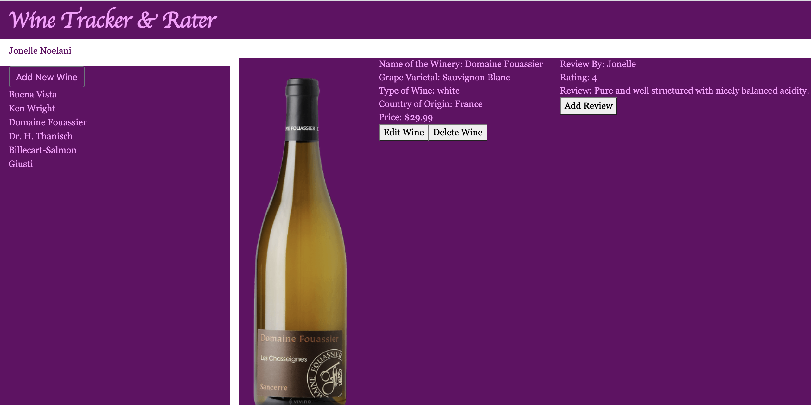

# Wine Tracker & Rater
#### By Jonelle Noelani Yacapin, 21 Dec 2020
#### A single page application for a user to track wines and wine reviews. 

## Technologies Used
* Ruby 2.6.1
* Rails 6.0.3
* Active Model Serializers 0.10.0
* JavaScript
* Bootstrap 4.5.3

## Description
A user can view his/her profile and list of wines inputed into application.  User can add new wines as well as edit and/or delete wines.

[](https://youtu.be/d00rt2eg4lA)

## Setup
* Fork and clone this repository.

Backend
```
$ cd wine-tracker-backend/
$ bundle install
$ rails db:create
$ rails db:migrate
$ rails db:seed
$ rails s
```
Frontend
```
$ cd wine-tracker-frontend/
$ open index.html
```

## Known Bugs
* Needs an ‘Edit Profile’ button to make changes to user profile.
* Needs an ‘Add Review’ button to add new reviews to a wine.
* When submit changes to a wine it temporarily adds a new wine to end of list.  Fixes itself on refresh.

## License
This software is licensed under the [MIT](https://choosealicense.com/licenses/mit/) license.

Copyright (c) 2020 Jonelle Noelani Yacapin

## Contact Information
Jonelle Noelani Yacapin fromwinetocode@gmail.com

## Project Status
A work in progress.  Plans to improve CSS and add features listed under ‘Known Bugs’.

## Related Blog
During this project I learned an important lesson about using serializers and wrote a blog that you can read here:  [What Exactly Does The Serializer Do?](https://levelup.gitconnected.com/what-exactly-does-the-serializer-do-9eee3c2e61b7?sk=301e7b30c351bab155b1a680b9bdbdf3)
>>>>>>>>>>>>>>>>>>>>>>>>>>>>>>>>>>>>>>>>>>>>>>>>>>>>>
## Up Next
[x] Have Title with event to return to "home" state  => I'll have to revisit this one
[x] Move profile name to upper right  => still needs adjusting
[ ] Change 'Add New Wine" button  
[ ] Add border and space to Producer Names